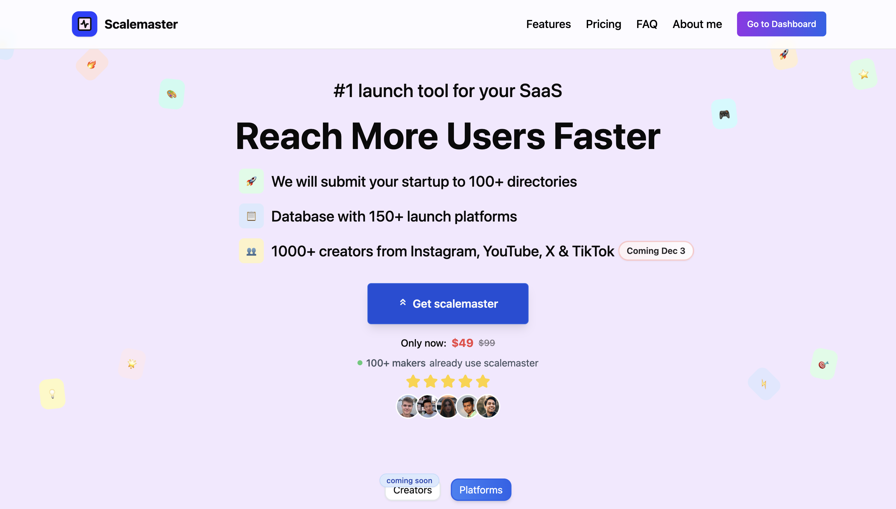
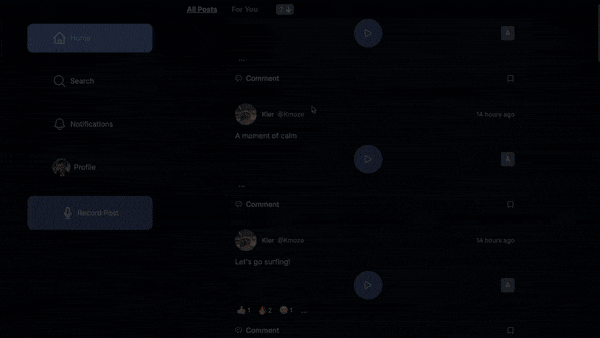

    
  
  

 
  

## 👨‍💻 About me 

- Fullstack developer.
- My latest projects are social media app and a mobile interactive scratch map app.
- I am passionate about building things.

## 🕹️ Technologies

  
  
  
  
  
  
  
  
  
  
  
  
  
  
  
  

## 🗂️ My projects

### [Scalemaster](https://scalemaster.app/)

Scalemaster is a solution for launching your SaaS! Access 150+ launch platforms and submit your product with just one form for automated submission in 12 hours.

### [Goss](https://github.com/salmon-01/gossip.git)

Twitter but for voice notes - an app that lets users share their opinion using voice. The project was built with **NextJS** using mobile-first design approach. The backend of the project was built with **Supabase**. **Vitest** was used for unit testing for the majority of the components. Integration of **Whisper 1.0** and **PlayHT** enables the audio-to-text transcription and text-to-audio using various voices.

### [Mappy](https://github.com/salmon-01/mappy.git)

Interactive scratch map on your iPhone. Built front end with **react native** and **expo**. As for the backend **express** and **supabase** was used. Interact with a map provided by **MapBox API** by selecting and highlighting the countries you've visited or want to visit. The dashboard will tell brief statistics about your travels and your dream destinations.

## Past Projects

### [Atomize Pro](https://github.com/salmon-01/atomize-pro) (Refactor)

A forked productivity tool project. My part of the project was to refactor the code from **javascript** to **typescript** and optimize the codebase. Multiple data leaks were mitigated. Moreover, whole backend was refactored from express and raw SQL to **express** and **sequelize**. From the refactoring achievements that stand out (ex.: achievement - 'from' - 'to'): visible state 17 - 6, state variables - 30 - 9, useEffects - 14 - 1, completely eliminated prop drilling.
